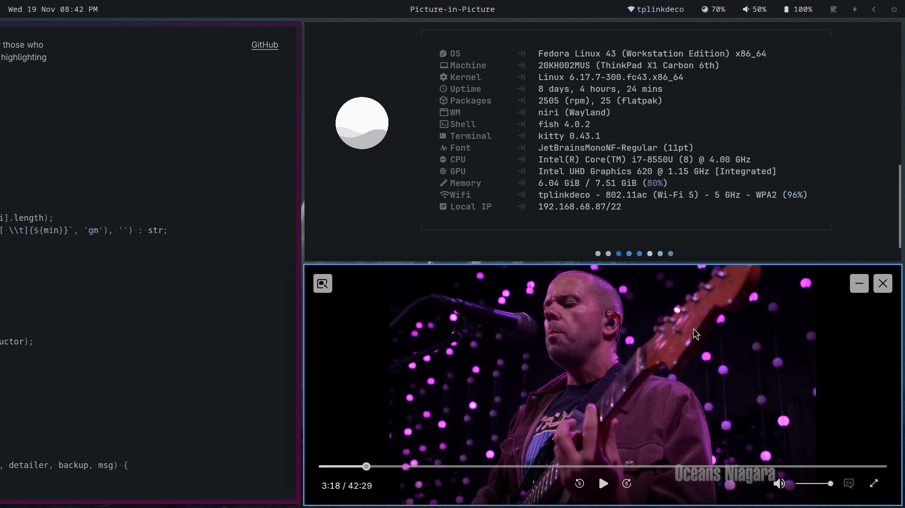
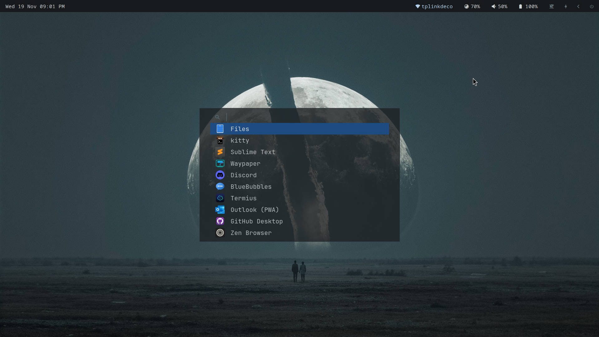

# Moondust Inspired Niri + Waybar Theme

My config files for a minimal, blue-gray color theme for [Niri](https://github.com/YaLTeR/niri), Waybar, Kitty, and so on, based on the amazing [Moondust theme](https://github.com/vanyauhalin/moondusttheme/) by Ivan Uhalin.

> [!NOTE]
> The Waybar statusbar is now rounded and translucent (see screenshot 1). If you prefer the 'flat' style, swap with the flat-config.jsonc and flat-style.css.

> [!IMPORTANT] 
> I'm new to Niri, and configuration like this in general. This setup is very much a work-in-progress and draws heavily from far more talented folks in the [Niri Setup Showcase](https://github.com/YaLTeR/niri/discussions/325). Contributions, suggestions, and PRs are welcome and encouraged. 

## Preview

<table>
  <tr>
    <td></td>
    <td></td>
    <td></td>
  </tr>
</table>

## Configs

This repository includes my Moondust-styled configurations for:

- Fastfetch (system info display)
- Fish (shell + Fisher theme)
- Fuzzel (application launcher)
- Kitty (terminal emulator)
- Mako (notifications)
- Niri (Wayland tiling compositor)
- Starship (prompt)
- Sublime Text (editor, themed)
- Waybar (status bar)

## Color Palette

### Dark Theme

#### Background

| Name | Hex | Preview |
|------|-----|---------|
| **Background** | `#161A1D` |  |

*Editor/terminal background*

#### Gray

| Index | Hex | Preview |
|-------|-----|---------|
| **0** | `#D2D4D5` |  |
| **1** | `#B1B6B9` |  |
| **2** | `#89949A` |  |
| **3** | `#637179` |  |
| **4** | `#455259` |  |
| **5** | `#343F46` |  |
| **6** | `#2C343A` |  |
| **7** | `#262C31` |  |
| **8** | `#22272B` |  |
| **9** | `#1E2225` |  |

*Neutral grays from brightest (0) to darkest (9)*

#### Slate

| Index | Hex | Preview |
|-------|-----|---------|
| **0** | `#B2D0EB` |  |
| **1** | `#8FAFCC` |  |
| **2** | `#6885A1` |  |
| **3** | `#4D6680` |  |
| **4** | `#3C5167` |  |
| **5** | `#304255` |  |
| **6** | `#273545` |  |
| **7** | `#222D39` |  |
| **8** | `#1F262E` |  |
| **9** | `#1E2329` |  |

*Blue-gray tones from brightest (0) to darkest (9)*

#### Blue

| Index | Hex | Preview |
|-------|-----|---------|
| **0** | `#4D8FDB` |  |
| **1** | `#3A82CF` |  |
| **2** | `#2C75C3` |  |
| **3** | `#2769B4` |  |
| **4** | `#235D9F` |  |
| **5** | `#1C4C82` |  |
| **6** | `#173E6E` |  |
| **7** | `#133358` |  |
| **8** | `#112945` |  |
| **9** | `#10243C` |  |

*Accent blues from brightest (0) to darkest (9)*

### Non-Canonical Colors

These colors are used for specific UI purposes but are not part of the canonical Moondust palette:

| Name | Hex | Preview | Usage |
|------|-----|---------|-------|
| **Warning** | `#E8B87E` |  | Warning states (Mako only) |
| **Critical** | `#E67C7C` |  | Critical/error states, power button |

## Quick Reference

### Common UI Elements
| Element | Color | Hex | Preview |
|---------|-------|-----|---------|
| Background | Background | `#161A1D` |  |
| Foreground | Gray 1 | `#B1B6B9` |  |
| Selection | Blue 2 | `#2C75C3` |  |
| Border | Gray 5 | `#343F46` |  |
| Link/Hover | Blue 0 | `#4D8FDB` |  |
| Comment | Gray 3 | `#637179` |  |

### Syntax Colors
| Element | Color | Hex | Preview |
|---------|-------|-----|---------|
| Keywords | Gray 2 | `#89949A` |  |
| Text/Variables | Gray 1 | `#B1B6B9` |  |
| Strings | Slate 1 | `#8FAFCC` |  |
| String Quotes | Slate 2 | `#6885A1` |  |
| Comments | Gray 3 | `#637179` |  |

## Resources

- [Official Moondust Theme](https://moondustthe.me/)
- [VS Code Theme](https://marketplace.visualstudio.com/items?itemName=vanyauhalin.moondusttheme)
- [Color Definitions](https://github.com/vanyauhalin/moondusttheme/blob/main/lib/colors.js)

## License

Based on Moondust by Ivan Uhalin (MIT License)